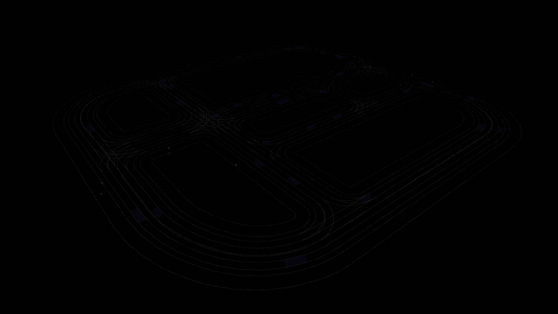

# lanelet2_object_list_prediction

<p align="center">
  <a href="https://openads-project.github.io"></a>
  <a href="https://www.ros.org"></a>
  <a href="https://github.com/openads-project/lanelet2_object_list_prediction/releases/latest"></a>
  <a href="https://github.com/openads-project/lanelet2_object_list_prediction/blob/main/LICENSE"></a>
  <br>
  <a href="https://github.com/openads-project/lanelet2_object_list_prediction/actions/workflows/docker-ros.yml"></a>
  <a href="https://github.com/openads-project/lanelet2_object_list_prediction/actions/workflows/compose-oci.yml"></a>
  <a href="https://github.com/openads-project/lanelet2_object_list_prediction/actions/workflows/helm-oci.yml"></a>
  <a href="https://openads-project.github.io/lanelet2_object_list_prediction"></a>
  <a href="https://github.com/openads-project/lanelet2_object_list_prediction/actions/workflows/consistency.yml"></a>
</p>

**ROS 2 Object List Prediction for Automated Driving based on Lanelet2**

The [lanelet2_object_list_prediction](lanelet2_object_list_prediction/README.md) node predicts the future trajectories of dynamic objects by leveraging [Lanelet2](https://github.com/fzi-forschungszentrum-informatik/Lanelet2) map information. It subscribes to an object list in an arbitrary sensor frame, matches each object to the most plausible lanelet based on position and orientation, and propagates the objects along the lane geometry for a configurable prediction horizon. Objects that cannot be matched to the map are handled via a fallback mode (static or kinematic). The node publishes an enriched object list, transformed into the Lanelet2 map frame, with predicted states at each sampling interval.

<p align="center">
  <strong>🚀 <a href="#-quick-start">Quick Start</a></strong> • <strong>💻 <a href="#-development">Development</a></strong> • <strong>📝 <a href="#-documentation">Documentation</a></strong>
</p>

> [!IMPORTANT]
> This repository is part of [***OpenADS***](https://openads-project.github.io/), the *Open Automated Driving Systems* project. *OpenADS* and its modules have been initiated and are currently being maintained by the [**Institute for Automotive Engineering (ika) at RWTH Aachen University**](https://www.ika.rwth-aachen.de/de/).


## 🚀 Quick Start

<p align="center">
  
</p>

1. Launch the [`demo/docker-compose.yml`](demo/docker-compose.yml) setup. This will open RViz with a visualization of a Lanelet2 map and replay a recorded scenario with predicted object trajectories.
    ```bash
    cd demo
    xhost +local: # allow GUI forwarding from containers
    docker compose up -d
    ```
2. Observe the predicted object trajectories visualized in RViz as the rosbag replay loops through the scenario.
3. Stop the demo and clean up.
    ```bash
    docker compose down
    xhost -local: # revoke GUI forwarding permissions
    ```

## 💻 Development

### Set up Development Environment

1. Clone the repository.
    ```bash
    git clone https://github.com/openads-project/lanelet2_object_list_prediction.git
    ```
1. Initialize the [`.openads-dev-environment`](https://github.com/openads-project/openads-dev-environment) submodule containing development environment configuration.
    ```bash
    cd lanelet2_object_list_prediction
    git submodule update --init --recursive
    ```
1. Open the repository in [Visual Studio Code](https://code.visualstudio.com).
    ```bash
    code .
    ```
1. Install the recommended VS Code extensions.
    > *Ctrl+Shift+P / Extensions: Show Recommended Extensions / Install Workspace Recommended Extensions (Cloud Download Icon)*
1. Reopen the repository in a [Dev Container](https://code.visualstudio.com/docs/devcontainers/containers).
    > *Ctrl+Shift+P / Dev Containers: Rebuild and Reopen in Container*

### Build

> *Ctrl+Shift+B*

```bash
colcon build
```

### Run Tests

> *Ctrl+Shift+P / Tasks: Run Test Task*

```bash
colcon build --cmake-args -DCMAKE_EXPORT_COMPILE_COMMANDS=1
colcon test
colcon test-result --verbose
```


## 📝 Documentation

Package and node interfaces are documented in the respective package READMEs listed below. Implementation details are found in the [Source Code Documentation](https://openads-project.github.io/lanelet2_object_list_prediction).

| Package | Description |
| --- | --- |
| [lanelet2_object_list_prediction](lanelet2_object_list_prediction/README.md) | Predicts future states of multiple objects based on a Lanelet2 Map |

## ⚖️ Licensing

The source code in this repository is licensed under Apache-2.0, see [LICENSE](LICENSE). Container images provided by this repository may contain third-party software shipped with their own license terms.

## 🙏 Acknowledgements

Development and maintenance of this repository are supported by the following projects. We acknowledge the funding of the respective institutions.

| Project | Funding Institution | Grant Number |
| --- | --- | --- |
| [AIGGREGATE](https://aiggregate.eu/) | 🇪🇺 European Union | 101202457 |

<p>
  
  
</p>

<sub><sup>Funded by the European Union. Views and opinions expressed are however those of the author(s) only and do not necessarily reflect those of the European Union or the European Climate, Infrastructure and Environment Executive Agency (CINEA). Neither the European Union nor CINEA can be held responsible for them.</sup></sub>
