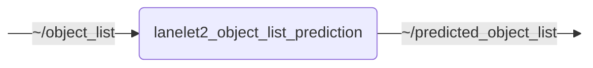

# `lanelet2_object_list_prediction`

Predicts object movements via Lanelet2 map information

## Nodes

### `lanelet2_object_list_prediction`

TODO: Detailed description of the module.

#### Subscribed Topics

| Topic | Type | Description |
| --- | --- | --- |
| `~/object_list` | `perception_msgs/msg/ObjectList` | TODO |

#### Published Topics

| Topic | Type | Description |
| --- | --- | --- |
| `~/predicted_object_list` | `perception_msgs/msg/ObjectList` | TODO |

#### Parameters

| Parameter | Type | Default | Description |
| --- | --- | --- | --- |
| `ll2_map_server_name` | `string` | `"lanelet2_map_server"` | Name of lanelet2_map_server node |
| `lanelet_match_max_distance_m` | `float` | `0.0` | Maximum distance in meters for matching an object to a lanelet |
| `lanelet_match_max_yaw_diff_rad` | `float` | `1.57079632679` | Maximum yaw difference in radians for accepting a lanelet match |
| `prediction_horizon_s` | `float` | `5.0` | Prediction horizon in seconds |
| `prediction_sample_interval_s` | `float` | `0.5` | Sampling interval of predicted states in seconds |
| `unmatched_object_prediction_mode` | `string` | `"kinematic"` | Prediction mode for objects that are not matched to the map |

## Launch Files

### [`lanelet2_object_list_prediction_launch.py`](launch/lanelet2_object_list_prediction_launch.py)

| Argument | Default | Description |
| --- | --- | --- |
| `object_list_topic` | `"~/object_list"` | TODO |
| `predicted_object_list_topic` | `"~/predicted_object_list"` | TODO |
| `name` | `"lanelet2_object_list_prediction"` | node name |
| `namespace` | `""` | node namespace |
| `params` | `os.path.join(get_package_share_directory("lanelet2_object_list_prediction"), "config", "params.yml")` | path to parameter file |
| `log_level` | `"info"` | ROS logging level (debug, info, warn, error, fatal) |
| `use_sim_time` | `"false"` | use simulation clock |
