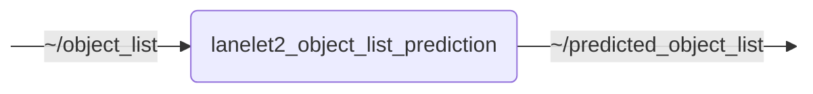

# `lanelet2_object_list_prediction`

Predicts future states of multiple objects based on a Lanelet2 Map

## Nodes

### `lanelet2_object_list_prediction`

Subscribes to a list of objects in an arbitrary sensor frame, transforms them into the Lanelet2 map frame, and publishes an enriched object list with trajectory predictions attached to each object.

For vehicles and other road users, the node matches each object to the nearest lanelet in the map, queries the routing graph for all reachable paths within the prediction horizon, and samples predicted states at fixed time intervals along each path. Pedestrians are not matched to the road network and receive a constant-velocity prediction instead.

#### Subscribed Topics

| Topic | Type | Description |
| --- | --- | --- |
| `~/object_list` | `perception_msgs/msg/ObjectList` | Objects in any TF-reachable frame |

#### Published Topics

| Topic | Type | Description |
| --- | --- | --- |
| `~/predicted_object_list` | `perception_msgs/msg/ObjectList` | Objects in map frame with state predictions attached |

#### Parameters

| Parameter | Type | Default | Description |
| --- | --- | --- | --- |
| `ll2_map_server_name` | `string` | `"lanelet2_map_server"` | Name of lanelet2_map_server node |
| `lanelet_match_max_distance_m` | `float` | `0.0` | Maximum distance in meters for matching an object to a lanelet |
| `lanelet_match_max_yaw_diff_rad` | `float` | `1.57079632679` | Maximum yaw difference in radians for accepting a lanelet match |
| `prediction_horizon_s` | `float` | `5.0` | Prediction horizon in seconds |
| `prediction_sample_interval_s` | `float` | `0.5` | Sampling interval of predicted states in seconds |
| `unmatched_object_prediction_mode` | `string` | `"kinematic"` | Prediction mode for objects that are not matched to the map |
| `velocity_ema_alpha` | `float` | `0.3` | EMA smoothing factor for velocity updates (0=frozen, 1=raw) |
| `velocity_hold_time_s` | `float` | `0.5` | Seconds to hold the last velocity estimate before decay begins |
| `velocity_decay_time_constant_s` | `float` | `2.0` | Exponential decay time constant in seconds after the hold window |
| `arc_length_ema_alpha` | `float` | `0.3` | EMA smoothing factor for arc-length projection (0=frozen, 1=raw) |

## Launch Files

### [`lanelet2_object_list_prediction_launch.py`](launch/lanelet2_object_list_prediction_launch.py)

| Argument | Default | Description |
| --- | --- | --- |
| `object_list_topic` | `"~/object_list"` | Topic to subscribe for incoming objects |
| `predicted_object_list_topic` | `"~/predicted_object_list"` | Topic to publish objects with predictions |
| `name` | `"lanelet2_object_list_prediction"` | node name |
| `namespace` | `""` | node namespace |
| `params` | `os.path.join(get_package_share_directory("lanelet2_object_list_prediction"), "config", "params.yml")` | path to parameter file |
| `log_level` | `"info"` | ROS logging level (debug, info, warn, error, fatal) |
| `use_sim_time` | `"false"` | use simulation clock |
