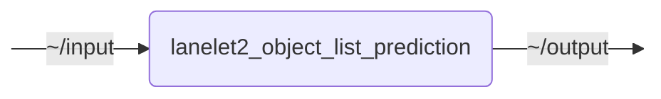

# `lanelet2_object_list_prediction`

TODO

- [Container Images](#container-images)
- [lanelet2_object_list_prediction](#lanelet2_object_list_prediction)

### Container Images

| Description | Image:Tag | Default Command |
| --- | --- | -- |
|  |  |  |

## Nodes

### `lanelet2_object_list_prediction`

#### Subscribed Topics

| Topic | Type | Description |
| --- | --- | --- |
| `~/input` | `geometry_msgs/msg/PointStamped` | TODO |

#### Published Topics

| Topic | Type | Description |
| --- | --- | --- |
| `~/output` | `geometry_msgs/msg/PointStamped` | TODO |

#### Parameters

| Parameter | Type | Default | Description |
| --- | --- | --- | --- |
| `param` | `float` | `1.0` | TODO |

## Launch Files

### [`lanelet2_object_list_prediction_launch.py`](launch/lanelet2_object_list_prediction_launch.py)

| Argument | Default | Description |
| --- | --- | --- |
| `input_topic` | `"~/input"` | TODO |
| `output_topic` | `"~/output"` | TODO |
| `name` | `"lanelet2_object_list_prediction"` | TODO |
| `namespace` | `""` | TODO |
| `params` | `os.path.join(get_package_share_directory("lanelet2_object_list_prediction"), "config", "params.yml")` | TODO |
| `log_level` | `"info"` | TODO |
| `use_sim_time` | `"false"` | TODO |
