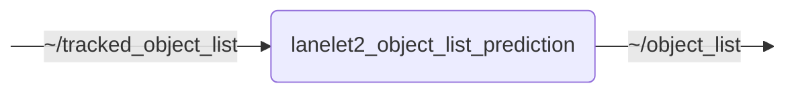

# `lanelet2_object_list_prediction`

Predicts future states of multiple objects based on a Lanelet2 Map

## Nodes

### `lanelet2_object_list_prediction`

Subscribes to a list of objects in an arbitrary sensor frame, transforms them into the Lanelet2 map frame, and publishes an enriched object list with trajectory predictions attached to each object.

The node matches each object to all lanelets whose area lies within `lanelet_match_max_distance_m` of the object's position and whose direction fits its heading, queries the routing graph for all reachable paths within the prediction horizon, and samples predicted states at fixed time intervals along each path. Objects without a lanelet match receive the prediction set by `unmatched_object_prediction_mode`.

Each feature has its own parameter group and can be switched on and off with its `enable` parameter.

**Participant-specific matching** (`participant_specific_matching`)

- Pedestrians and other vulnerable road users are matched and routed with the LL2 pedestrian rules, i.e. along walkways, crosswalks and other lanelets open to pedestrians.
- Bicycles and micromobility use the bicycle rules, as do motorcycles on bicycle lanes. If a bicycle lane matches, other matches are dropped.
- `allow_opposite_direction`: a two-wheeler without any legal match may be matched against a one-way lanelet's direction. It is then predicted backwards along the lanelet's legal predecessors.
- Disabled: pedestrians are not matched, and all other objects use the vehicle rules.

**Motion limits** (`motion_limits`)

- The predicted speed along each path is limited in curves, so that the lateral acceleration stays below `max_lateral_acceleration_mps2`. The curvature is taken from the heading of the path's centerline over 3 m chords. A median of the heading over 13 m removes short sideways steps and kinks of the map centerlines, e.g. at crossings, while turns are kept.
- The object brakes with at most `max_longitudinal_deceleration_mps2`, early enough to reach each curve at its limited speed. Predictions never get faster than the object is now: after a curve, the object regains its current speed with at most `max_longitudinal_acceleration_mps2`.
- A path is infeasible if the object is too fast to brake down for a curve ahead. Each infeasible path gets the probability `infeasible_prediction_probability`, and the feasible paths share the rest equally. If no path is feasible, the object gets the prediction set by `unmatched_object_prediction_mode` instead.
- Disabled: objects keep their current speed along each path.

```mermaid
flowchart LR
    NODE("lanelet2_object_list_prediction")
    S0:::hidden -->|~/tracked_object_list| NODE
    NODE -->|~/object_list| P0:::hidden
    classDef hidden display: none;
```

#### Subscribed Topics

| Topic | Type | Description |
| --- | --- | --- |
| `~/tracked_object_list` | `perception_msgs/msg/ObjectList` | Objects in any TF-reachable frame |

#### Published Topics

| Topic | Type | Description |
| --- | --- | --- |
| `~/object_list` | `perception_msgs/msg/ObjectList` | Objects in map frame with state predictions attached |

#### Parameters

| Parameter | Type | Default | Description |
| --- | --- | --- | --- |
| `ll2_map_server_name` | `string` | `"lanelet2_map_server"` | Name of lanelet2_map_server node |
| `lanelet_match_max_distance_m` | `float` | `0.5` | Maximum distance in meters for matching an object to a lanelet |
| `lanelet_match_max_yaw_diff_rad` | `float` | `1.57079632679` | Maximum yaw difference in radians for accepting a lanelet match |
| `prediction_horizon_s` | `float` | `5.0` | Prediction horizon in seconds |
| `prediction_sample_interval_s` | `float` | `0.5` | Sampling interval of predicted states in seconds |
| `unmatched_object_prediction_mode` | `string` | `"kinematic"` | Prediction mode for objects that are not matched to the map |
| `infeasible_prediction_probability` | `float` | `0.0` | Probability of each prediction that cannot be followed within the motion limits |
| `participant_specific_matching.enable` | `bool` | `true` | Match and route pedestrians and two-wheelers with their own traffic rules, preferring bicycle lanes for two-wheelers |
| `participant_specific_matching.allow_opposite_direction` | `bool` | `true` | Predict two-wheelers without a legal lanelet match against a lanelet's direction |
| `motion_limits.enable` | `bool` | `true` | Reduce the predicted speed in curves to respect the lateral and longitudinal acceleration limits |
| `motion_limits.max_lateral_acceleration_mps2` | `float` | `3.0` | Maximum lateral acceleration in m/s^2 of predicted objects in curves |
| `motion_limits.max_longitudinal_acceleration_mps2` | `float` | `1.0` | Maximum longitudinal acceleration in m/s^2 of predicted objects regaining their current speed after slowing down, e.g. after a curve; predictions never exceed the current speed |
| `motion_limits.max_longitudinal_deceleration_mps2` | `float` | `2.0` | Maximum longitudinal deceleration in m/s^2 of predicted objects slowing down, e.g. before a curve |

## Launch Files

### [`lanelet2_object_list_prediction_launch.py`](launch/lanelet2_object_list_prediction_launch.py)

| Argument | Default | Description |
| --- | --- | --- |
| `tracked_object_list_topic` | `"~/tracked_object_list"` | Topic to subscribe for incoming objects |
| `object_list_topic` | `"~/object_list"` | Topic to publish objects with predictions |
| `name` | `"lanelet2_object_list_prediction"` | node name |
| `namespace` | `""` | node namespace |
| `params` | `os.path.join(get_package_share_directory("lanelet2_object_list_prediction"), "config", "params.yml")` | path to parameter file |
| `log_level` | `"info"` | ROS logging level (debug, info, warn, error, fatal) |
| `use_sim_time` | `"false"` | use simulation clock |
| `ros_tracing` | `"false"` | enable tracing |
