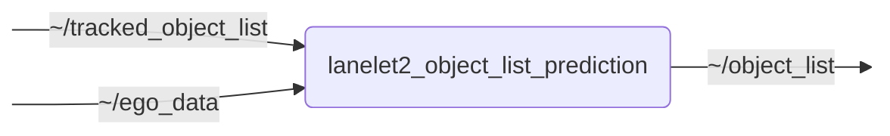

# `lanelet2_object_list_prediction`

Predicts future states of multiple objects based on a Lanelet2 Map

## Nodes

### `lanelet2_object_list_prediction`

Subscribes to a list of objects in an arbitrary sensor frame, transforms them into the Lanelet2 map frame, and publishes an enriched object list with trajectory predictions attached to each object.

For each incoming object list, the node:

- Checks that the map is available, refreshes routing graphs when it changes, and transforms the list into the map frame. Lists are skipped if the map or required TF transform is unavailable.
- Matches each object to nearby lanelets using its classification, position, heading, velocity, and participant-specific traffic rules. Bicycles and pedestrians prefer dedicated lanes and walkways; motorcycles optionally prefer bicycle lanes, and VRUs exclude stairs. Nearly sideways motion is rejected. Detections can optionally be snapped to the best matched centerline.
- Creates route hypotheses from each match using the corresponding routing graph, the measured speed along the lane, and the prediction horizon, without lane changes. Reverse motion stays within the current lanelet. Motion profiles account for curves, route ends, and configured acceleration/braking limits, marking infeasible hypotheses. Initial-motion feasibility checks include configurable roundabout tolerance.
- Validates the latest ego data and transforms it into the map frame. Without a usable ego plan, interactions between other objects still apply.
- If enabled, applies right-of-way constraints using the whole scene's nominal route hypotheses and ego plan: objects brake before applicable yield lines, wait for priority traffic to clear plus a safety interval, then accelerate.
- If enabled, applies one following pass using the yielded scene and ego plan: followers adjust speed to maintain a minimum bumper gap and speed-dependent headway behind leaders on the same directed lanelet. Impossible braking marks a hypothesis infeasible.
- Samples timestamped states over the configured horizon and interval, updating position, heading, and velocity. Predictions follow centerlines or smoothly converge from the observed motion, depending on configuration. Infeasible hypotheses are discarded when their configured probability is zero; retained hypotheses receive normalized probabilities, with motorcycle matches weighted by centerline proximity. If no hypothesis remains, uses the configured stationary or constant-velocity fallback, or a stationary centerline prediction for matched objects when centerline enforcement is enabled.
- Attaches the predictions to each object and publishes the enriched list in the map frame, retaining the input list's timestamp.

```mermaid
flowchart LR
    NODE("lanelet2_object_list_prediction")
    S0:::hidden -->|~/tracked_object_list| NODE
    S1:::hidden -->|~/ego_data| NODE
    NODE -->|~/object_list| P0:::hidden
    classDef hidden display: none;
```

#### Subscribed Topics

| Topic | Type | Description |
| --- | --- | --- |
| `~/tracked_object_list` | `perception_msgs/msg/ObjectList` | Objects in any TF-reachable frame |
| `~/ego_data` | `perception_msgs/msg/EgoData` | Ego state and planned trajectory in any TF-reachable frame |

#### Published Topics

| Topic | Type | Description |
| --- | --- | --- |
| `~/object_list` | `perception_msgs/msg/ObjectList` | Objects in map frame with state predictions attached |

#### Parameters

| Parameter | Type | Default | Description |
| --- | --- | --- | --- |
| `input.ego_data_timeout` | `float` | `1.0` | timeout for considering ego vehicle data [s] |
| `processing.map_matching.ll2_map_server_name` | `string` | `"lanelet2_map_server"` | name of lanelet2_map_server node |
| `processing.map_matching.max_distance` | `float` | `0.5` | max distance from a lanelet to consider it a match [m] |
| `processing.map_matching.bicycle_max_distance` | `float` | `1.0` | max distance from a lanelet to consider it a match for bicycles, riding at lane edges [m] |
| `processing.map_matching.max_delta_yaw_deg` | `float` | `90.0` | max yaw difference from a lanelet direction to consider it a match [deg] |
| `processing.map_matching.prefer_bicycle_lanes_for_motorcycles` | `bool` | `true` | prefer valid bicycle lane matches over vehicle lanes for motorcycles |
| `processing.map_matching.fallback_mode` | `string` | `"kinematic"` | fallback mode for objects not matched to map [kinematic|static] |
| `processing.map_following.enforce_centerline` | `bool` | `true` | place matched predictions on the lane centerline |
| `processing.map_following.reset_detection_to_centerline` | `bool` | `false` | also place matched detections on the lane centerline |
| `processing.kinematic_limitations.enable` | `bool` | `true` | enable kinematic limitations |
| `processing.kinematic_limitations.max_lateral_acceleration` | `float` | `2.5` | max lateral acceleration for predictions [m/s^2] |
| `processing.kinematic_limitations.max_longitudinal_deceleration` | `float` | `2.0` | max longitudinal deceleration for predictions [m/s^2] |
| `processing.kinematic_limitations.max_longitudinal_acceleration` | `float` | `1.0` | max longitudinal acceleration for predictions [m/s^2] |
| `processing.yielding.enable` | `bool` | `true` | enable yielding |
| `processing.yielding.clearance_distance` | `float` | `0.5` | clearance between front and yield line [m] |
| `processing.yielding.clearance_time` | `float` | `1.0` | time gap required before and after priority traffic [s] |
| `processing.yielding.ego_lookahead_time` | `float` | `8.0` | time up to which ego's right of way is considered, extrapolating its planned trajectory [s] |
| `processing.following.enable` | `bool` | `true` | enable following, avoiding collisions with leading objects |
| `processing.following.headway_distance` | `float` | `2.0` | min distance to the leading object [m] |
| `processing.following.headway_time` | `float` | `1.0` | min time headway to the leading object [s] |
| `processing.roundabout.enable` | `bool` | `true` | enable special roundabout handling |
| `processing.roundabout.initial_alignment_tolerance` | `float` | `1.0` | tolerance for initial alignment with roundabout centerline, not respecting kinematic limitations [m] |
| `output.prediction_horizon` | `float` | `5.0` | prediction time horizon [s] |
| `output.sample_interval` | `float` | `0.5` | time interval between prediction samples [s] |
| `output.infeasible_hypothesis_probability` | `float` | `0.0` | probability for infeasible hypotheses |

## Launch Files

### [`lanelet2_object_list_prediction_launch.py`](launch/lanelet2_object_list_prediction_launch.py)

| Argument | Default | Description |
| --- | --- | --- |
| `tracked_object_list_topic` | `"~/tracked_object_list"` | Topic to subscribe for incoming objects |
| `ego_data_topic` | `"~/ego_data"` | Topic to subscribe for ego state and planned trajectory |
| `object_list_topic` | `"~/object_list"` | Topic to publish objects with predictions |
| `name` | `"lanelet2_object_list_prediction"` | node name |
| `namespace` | `""` | node namespace |
| `params` | `os.path.join(get_package_share_directory("lanelet2_object_list_prediction"), "config", "params.yml")` | path to parameter file |
| `log_level` | `"info"` | ROS logging level (debug, info, warn, error, fatal) |
| `use_sim_time` | `"false"` | use simulation clock |
| `ros_tracing` | `"false"` | enable tracing |
