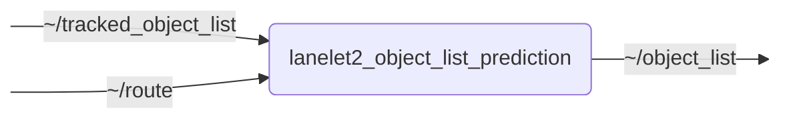

# `lanelet2_object_list_prediction`

Predicts future states of multiple objects based on a Lanelet2 Map

## Nodes

### `lanelet2_object_list_prediction`

Subscribes to a list of objects in an arbitrary sensor frame, transforms them into the Lanelet2 map frame, and publishes an enriched object list with trajectory predictions attached to each object.

The node matches each object to all lanelets whose area lies within `lanelet_match_max_distance_m` of the object's position and whose direction fits its heading, queries the routing graph for all reachable paths within the prediction horizon, and samples predicted states at fixed time intervals along each path. Objects without a lanelet match receive the prediction set by `unmatched_object_prediction_mode`.

Each feature has its own parameter group and can be switched on and off with its `enable` parameter. The features are described in [IMPLEMENTATION.md](IMPLEMENTATION.md).

```mermaid
flowchart LR
    NODE("lanelet2_object_list_prediction")
    S0:::hidden -->|~/tracked_object_list| NODE
    S1:::hidden -->|~/route| NODE
    NODE -->|~/object_list| P0:::hidden
    classDef hidden display: none;
```

#### Subscribed Topics

| Topic | Type | Description |
| --- | --- | --- |
| `~/tracked_object_list` | `perception_msgs/msg/ObjectList` | Objects in any TF-reachable frame |
| `~/route` | `route_planning_msgs/msg/Route` | Planned route of ego in map frame, which has right of way for yielding |

#### Published Topics

| Topic | Type | Description |
| --- | --- | --- |
| `~/object_list` | `perception_msgs/msg/ObjectList` | Objects in map frame with state predictions attached |

#### Parameters

| Parameter | Type | Default | Description |
| --- | --- | --- | --- |
| `ll2_map_server_name` | `string` | `"lanelet2_map_server"` | Name of lanelet2_map_server node |
| `lanelet_match_max_distance_m` | `float` | `0.5` | Maximum distance in meters for matching an object to a lanelet |
| `lanelet_match_max_yaw_diff_rad` | `float` | `1.57079632679` | Maximum yaw difference in radians for accepting a lanelet match |
| `prediction_horizon_s` | `float` | `5.0` | Prediction horizon in seconds |
| `prediction_sample_interval_s` | `float` | `0.5` | Sampling interval of predicted states in seconds |
| `unmatched_object_prediction_mode` | `string` | `"kinematic"` | Prediction mode for objects that are not matched to the map |
| `infeasible_prediction_probability` | `float` | `0.0` | Probability of each prediction that cannot be followed within the motion limits |
| `max_longitudinal_acceleration_mps2` | `float` | `1.0` | Maximum longitudinal acceleration in m/s^2 of predicted objects regaining their current speed after slowing down, e.g. after a curve; predictions never exceed the current speed |
| `max_longitudinal_deceleration_mps2` | `float` | `3.0` | Maximum longitudinal deceleration in m/s^2 of predicted objects slowing down, e.g. before a curve or a yield line |
| `participant_specific_matching.enable` | `bool` | `true` | Match and route pedestrians and two-wheelers with their own traffic rules, preferring bicycle lanes for two-wheelers |
| `participant_specific_matching.allow_opposite_direction` | `bool` | `true` | Predict two-wheelers without a legal lanelet match against a lanelet's direction |
| `motion_limits.enable` | `bool` | `true` | Reduce the predicted speed in curves to respect the lateral and longitudinal acceleration limits |
| `motion_limits.max_lateral_acceleration_mps2` | `float` | `3.0` | Maximum lateral acceleration in m/s^2 of predicted objects in curves |
| `yielding.enable` | `bool` | `true` | Stop objects at yield lines for conflicting priority traffic, i.e. other objects and ego |

## Launch Files

### [`lanelet2_object_list_prediction_launch.py`](launch/lanelet2_object_list_prediction_launch.py)

| Argument | Default | Description |
| --- | --- | --- |
| `tracked_object_list_topic` | `"~/tracked_object_list"` | Topic to subscribe for incoming objects |
| `route_topic` | `"~/route"` | Topic to subscribe for the route of ego |
| `object_list_topic` | `"~/object_list"` | Topic to publish objects with predictions |
| `name` | `"lanelet2_object_list_prediction"` | node name |
| `namespace` | `""` | node namespace |
| `params` | `os.path.join(get_package_share_directory("lanelet2_object_list_prediction"), "config", "params.yml")` | path to parameter file |
| `log_level` | `"info"` | ROS logging level (debug, info, warn, error, fatal) |
| `use_sim_time` | `"false"` | use simulation clock |
| `ros_tracing` | `"false"` | enable tracing |
