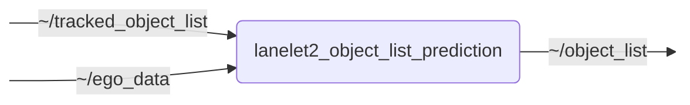

# `lanelet2_object_list_prediction`

Predicts future states of multiple objects based on a Lanelet2 Map

## Nodes

### `lanelet2_object_list_prediction`

Subscribes to a list of objects in an arbitrary sensor frame, transforms them into the Lanelet2 map frame, and publishes an enriched object list with trajectory predictions attached to each object.

For vehicles and other road users, the node matches each object to the nearest lanelet in the map, queries the routing graph for all reachable paths within the prediction horizon, and samples predicted states at fixed time intervals along each path. Pedestrians are not matched to the road network and receive a constant-velocity prediction instead.

```mermaid
flowchart LR
    NODE("lanelet2_object_list_prediction")
    S0:::hidden -->|~/tracked_object_list| NODE
    S1:::hidden -->|~/ego_data| NODE
    NODE -->|~/object_list| P0:::hidden
    classDef hidden display: none;
```

#### Subscribed Topics

| Topic | Type | Description |
| --- | --- | --- |
| `~/tracked_object_list` | `perception_msgs/msg/ObjectList` | Objects in any TF-reachable frame |
| `~/ego_data` | `perception_msgs/msg/EgoData` | Ego state and planned trajectory in any TF-reachable frame |

#### Published Topics

| Topic | Type | Description |
| --- | --- | --- |
| `~/object_list` | `perception_msgs/msg/ObjectList` | Objects in map frame with state predictions attached |

#### Parameters

| Parameter | Type | Default | Description |
| --- | --- | --- | --- |
| `ll2_map_server_name` | `string` | `"lanelet2_map_server"` | Name of lanelet2_map_server node |
| `lanelet_match_max_distance_m` | `float` | `0.5` | Maximum distance in meters for matching an object to a lanelet |
| `lanelet_match_max_yaw_diff_rad` | `float` | `1.57079632679` | Maximum yaw difference in radians for accepting a lanelet match |
| `prediction_horizon_s` | `float` | `5.0` | Prediction horizon in seconds |
| `prediction_sample_interval_s` | `float` | `0.5` | Sampling interval of predicted states in seconds |
| `max_lateral_acceleration_mps2` | `float` | `2.5` | Maximum lateral acceleration used to limit map-based prediction speed |
| `max_longitudinal_deceleration_mps2` | `float` | `2.0` | Maximum longitudinal deceleration magnitude used before curves |
| `max_longitudinal_acceleration_mps2` | `float` | `1.0` | Maximum longitudinal acceleration used to return to the observed speed after curves |
| `infeasible_hypothesis_probability` | `float` | `0.01` | Probability assigned to each kinematically infeasible route when feasible alternatives exist. Set to `0.0` to discard infeasible routes entirely; if none remain, use `unmatched_object_prediction_mode`. |
| `yield_prediction_enabled` | `bool` | `true` | Apply Lanelet2 right-of-way rules to interacting predictions |
| `yield_stop_margin_m` | `float` | `0.5` | Clearance between an object's front and a yield line |
| `yield_clearance_time_s` | `float` | `1.0` | Time to wait after priority traffic clears |
| `ego_data_timeout_s` | `float` | `1.0` | Maximum ego-data age used for interaction prediction |
| `unmatched_object_prediction_mode` | `string` | `"kinematic"` | Prediction mode for objects that are not matched to the map |

Map-based predictions project measured planar velocity onto the matched lanelet. Moving vehicles follow that direction,
including backward motion within their current lanelet. The path starts with the observed lateral velocity and smoothly
converges to the centerline over a distance chosen from the lateral acceleration limit. Body heading remains separate from travel
direction. Nearly sideways motion uses the Cartesian constant-velocity fallback. Reverse predictions stop at the current
lanelet boundary because the routing graph describes forward legal travel. A route is marked infeasible when
its first predicted displacement would require more acceleration than the configured longitudinal or lateral limits.

Right-of-way interactions are evaluated once from the nominal hypotheses of the complete scene. Every route hypothesis can
cause another object to yield. Yielding predictions brake before the mapped yield line, wait until ego or another predicted
object has cleared the priority lanelets, and then accelerate within the configured kinematic limits. Missing or stale ego
data disables ego interaction only; object-to-object interaction remains active.

## Launch Files

### [`lanelet2_object_list_prediction_launch.py`](launch/lanelet2_object_list_prediction_launch.py)

| Argument | Default | Description |
| --- | --- | --- |
| `tracked_object_list_topic` | `"~/tracked_object_list"` | Topic to subscribe for incoming objects |
| `ego_data_topic` | `"~/ego_data"` | Topic to subscribe for ego state and planned trajectory |
| `object_list_topic` | `"~/object_list"` | Topic to publish objects with predictions |
| `name` | `"lanelet2_object_list_prediction"` | node name |
| `namespace` | `""` | node namespace |
| `params` | `os.path.join(get_package_share_directory("lanelet2_object_list_prediction"), "config", "params.yml")` | path to parameter file |
| `log_level` | `"info"` | ROS logging level (debug, info, warn, error, fatal) |
| `use_sim_time` | `"false"` | use simulation clock |
| `ros_tracing` | `"false"` | enable tracing |
