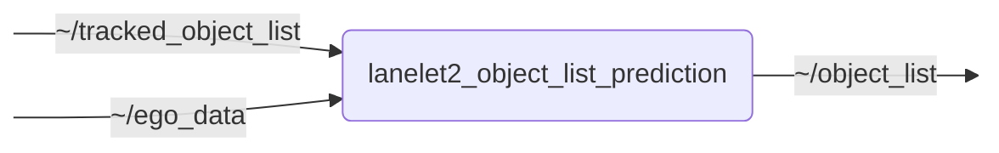

# `lanelet2_object_list_prediction`

Predicts future states of multiple objects based on a Lanelet2 Map

## Nodes

### `lanelet2_object_list_prediction`

Subscribes to a list of objects in an arbitrary sensor frame, transforms them into the Lanelet2 map frame, and publishes an enriched object list with trajectory predictions attached to each object.

The node matches objects to nearby lanelets permitted by their participant rules, queries the corresponding routing graph for reachable paths within the prediction horizon, and samples predicted states along each path. Bicycles and micromobility devices use bicycle rules and prefer dedicated bicycle lanes. Pedestrians and sidewalk users (VRU, such as wheelchairs and strollers) use pedestrian rules and prefer walkways, shared walkways, and crosswalks. VRU predictions exclude stairs. Motorcycles consider both vehicle lanes and dedicated bicycle lanes, but prefer a valid bicycle lane match when `processing.map_matching.prefer_bicycle_lanes_for_motorcycles` is true. Feasible motorcycle hypotheses closer to the observed position's lane centerline receive more probability. Objects without a suitable lanelet match use the configured Cartesian fallback. With `processing.map_following.enforce_centerline` enabled, every matched prediction is placed on the mapped centerline with its tangent orientation. `processing.map_following.reset_detection_to_centerline` additionally snaps the reported detection to the best matched lane and aligns its heading and velocity. When the detection remains at its observed pose, the first jump to the centerline is exempt from the initial acceleration check. Later kinematic, yielding, and following calculations still use the lane route. Unmatched objects retain the configured Cartesian fallback. If a matched object has no feasible route, its predictions stay at the best matched centerline position.

Map-based predictions project measured planar velocity onto the matched lanelet. Moving vehicles follow that direction,
including backward motion within their current lanelet. With centerline enforcement disabled, the path starts with the
observed lateral velocity and smoothly converges to the centerline over a distance chosen from the lateral acceleration
limit. Body heading remains separate from travel direction. Nearly sideways motion uses the Cartesian constant-velocity
fallback. Reverse predictions stop at the current lanelet boundary because the routing graph describes forward legal
travel. The initial acceleration check rejects unreachable first displacements when centerline enforcement is disabled
or the detection is reset to the centerline. It is skipped for the intentional first jump when centerline enforcement is
on and the detection is retained. Route curvature and braking limits still apply. Each infeasible route receives
`output.infeasible_hypothesis_probability` when feasible alternatives exist; with `0.0`, infeasible routes are discarded.
If no feasible route remains, unmatched objects use `processing.map_matching.fallback_mode`, while matched objects in
centerline mode get a stationary prediction at the best matched centerline position. When `processing.roundabout.enable`
is true, routes beginning on or within 5 m of a lanelet tagged `intersection_type=roundabout` allow up to
`processing.roundabout.initial_alignment_tolerance` of first-step position error when that check applies.

Right-of-way interactions are evaluated once from the nominal hypotheses of the complete scene. Every route hypothesis can
cause another object to yield. Yielding predictions brake before the mapped yield line, wait until ego or another predicted
object has cleared the priority approach and its conflict with the turning route, plus the configured clearance time,
and then accelerate within the configured kinematic limits. Ego trajectory segments are interpolated so short priority
lanelets are detected even when no published sample falls inside them. Reference lines are projected onto the whole route,
including successors of the lanelet carrying the rule. A branch inherits the yield line only when Lanelet2 reports a
conflict between the lanelet at the yield line (or its immediate successor) and the priority lanelets or their
successors; a later crossing on the route does not make this line apply to every branch. An object already on the first successor still observes its predecessor's right-of-way rule until it passes
the reference line. Missing or stale ego
data disables ego interaction only; object-to-object interaction remains active.

After right-of-way constraints, a single following pass uses ego's planned trajectory and every feasible hypothesis of
other matched objects as possible leaders. Unmatched objects use their configured Cartesian fallback. A follower brakes
within the longitudinal deceleration limit to maintain a minimum bumper gap plus a speed-dependent headway, then
accelerates toward its observed speed when the leader moves away or leaves its route. Only participants on the same
directed lanelet are considered; crossing traffic remains handled by right-of-way rules. If the observed speed and gap
make braking impossible, the continuous hypothesis is marked infeasible. Following is evaluated once from the yielded
scene, so a slowdown caused by following does not propagate through a longer queue in the same callback. The
last ego trajectory pose is held if the published plan ends before the prediction horizon.

```mermaid
flowchart LR
    NODE("lanelet2_object_list_prediction")
    S0:::hidden -->|~/tracked_object_list| NODE
    S1:::hidden -->|~/ego_data| NODE
    NODE -->|~/object_list| P0:::hidden
    classDef hidden display: none;
```

#### Subscribed Topics

| Topic | Type | Description |
| --- | --- | --- |
| `~/tracked_object_list` | `perception_msgs/msg/ObjectList` | Objects in any TF-reachable frame |
| `~/ego_data` | `perception_msgs/msg/EgoData` | Ego state and planned trajectory in any TF-reachable frame |

#### Published Topics

| Topic | Type | Description |
| --- | --- | --- |
| `~/object_list` | `perception_msgs/msg/ObjectList` | Objects in map frame with state predictions attached |

#### Parameters

| Parameter | Type | Default | Description |
| --- | --- | --- | --- |
| `input.ego_data_timeout` | `float` | `1.0` | timeout for considering ego vehicle data [s] |
| `processing.map_matching.ll2_map_server_name` | `string` | `"lanelet2_map_server"` | name of lanelet2_map_server node |
| `processing.map_matching.max_distance` | `float` | `0.5` | max distance from a lanelet to consider it a match [m] |
| `processing.map_matching.bicycle_max_distance` | `float` | `1.0` | max distance from a lanelet to consider it a match for bicycles, riding at lane edges [m] |
| `processing.map_matching.max_delta_yaw_deg` | `float` | `90.0` | max yaw difference from a lanelet direction to consider it a match [deg] |
| `processing.map_matching.prefer_bicycle_lanes_for_motorcycles` | `bool` | `true` | prefer valid bicycle lane matches over vehicle lanes for motorcycles |
| `processing.map_matching.fallback_mode` | `string` | `"kinematic"` | fallback mode for objects not matched to map [kinematic|static] |
| `processing.map_following.enforce_centerline` | `bool` | `true` | place matched predictions on the lane centerline |
| `processing.map_following.reset_detection_to_centerline` | `bool` | `false` | also place matched detections on the lane centerline |
| `processing.kinematic_limitations.enable` | `bool` | `true` | enable kinematic limitations |
| `processing.kinematic_limitations.max_lateral_acceleration` | `float` | `2.5` | max lateral acceleration for predictions [m/s^2] |
| `processing.kinematic_limitations.max_longitudinal_deceleration` | `float` | `2.0` | max longitudinal deceleration for predictions [m/s^2] |
| `processing.kinematic_limitations.max_longitudinal_acceleration` | `float` | `1.0` | max longitudinal acceleration for predictions [m/s^2] |
| `processing.yielding.enable` | `bool` | `true` | enable yielding |
| `processing.yielding.clearance_distance` | `float` | `0.5` | clearance between front and yield line [m] |
| `processing.yielding.clearance_time` | `float` | `1.0` | time gap required before and after priority traffic [s] |
| `processing.yielding.ego_lookahead_time` | `float` | `8.0` | time up to which ego's right of way is considered, extrapolating its planned trajectory [s] |
| `processing.following.enable` | `bool` | `true` | enable following, avoiding collisions with leading objects |
| `processing.following.headway_distance` | `float` | `2.0` | min distance to the leading object [m] |
| `processing.following.headway_time` | `float` | `1.0` | min time headway to the leading object [s] |
| `processing.roundabout.enable` | `bool` | `true` | enable special roundabout handling |
| `processing.roundabout.initial_alignment_tolerance` | `float` | `1.0` | tolerance for initial alignment with roundabout centerline, not respecting kinematic limitations [m] |
| `output.prediction_horizon` | `float` | `5.0` | prediction time horizon [s] |
| `output.sample_interval` | `float` | `0.5` | time interval between prediction samples [s] |
| `output.infeasible_hypothesis_probability` | `float` | `0.0` | probability for infeasible hypotheses |

## Launch Files

### [`lanelet2_object_list_prediction_launch.py`](launch/lanelet2_object_list_prediction_launch.py)

| Argument | Default | Description |
| --- | --- | --- |
| `tracked_object_list_topic` | `"~/tracked_object_list"` | Topic to subscribe for incoming objects |
| `ego_data_topic` | `"~/ego_data"` | Topic to subscribe for ego state and planned trajectory |
| `object_list_topic` | `"~/object_list"` | Topic to publish objects with predictions |
| `name` | `"lanelet2_object_list_prediction"` | node name |
| `namespace` | `""` | node namespace |
| `params` | `os.path.join(get_package_share_directory("lanelet2_object_list_prediction"), "config", "params.yml")` | path to parameter file |
| `log_level` | `"info"` | ROS logging level (debug, info, warn, error, fatal) |
| `use_sim_time` | `"false"` | use simulation clock |
| `ros_tracing` | `"false"` | enable tracing |
